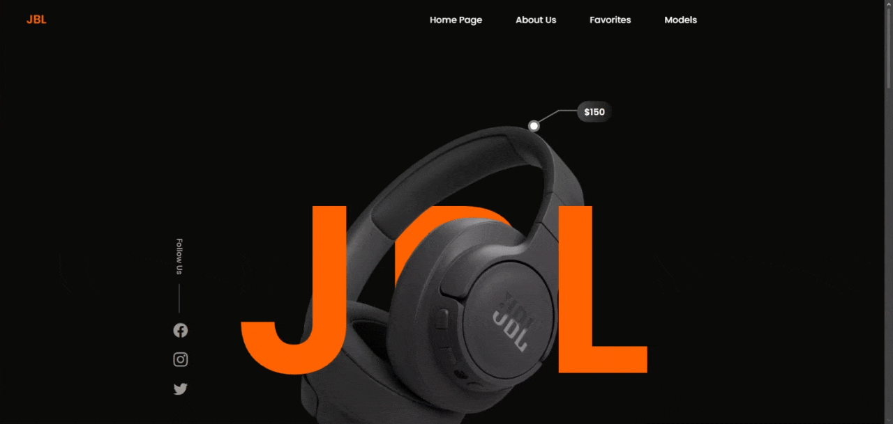

# JBL Clone Project

Welcome to the **JBL Clone Project**! A modern, responsive, and visually appealing e-commerce UI clone inspired by JBL’s official website. This project focuses on clean design, responsive layouts, and advanced styling using **SCSS** and **CSS Grid**.

## 🎯 Project Overview

The JBL Clone project allows users to:

- **Explore Products:** Modern product showcase inspired by JBL design language.
- **Responsive Design:** Fully optimized for desktop, tablet, and mobile devices.
- **Grid Layout System:** Structured and flexible layout using CSS Grid.
- **Modern UI:** Clean and stylish interface with smooth user experience.
- **Reusable Components:** Organized SCSS structure for maintainability.

## 🚀 Features

- **Responsive Layout:** Mobile-first design approach.
- **SCSS Architecture:** Modular and maintainable styling system.
- **CSS Grid System:** Advanced layout management.
- **Hover Effects:** Interactive UI elements for better UX.
- **Modern Design:** Inspired by real-world JBL website aesthetics.

## 🛠️ Technologies Used

- **HTML5** (Markup)
- **SCSS (Sass)** (Styling)
- **CSS Grid** (Layout System)
- **Responsive Design** (Media Queries)

## 📸 Preview



## ⚙️ Setup & Installation

To run the project locally:

```bash
# Clone the repository
git clone https://github.com/your-username/jbl-clone.git

# Navigate to the project folder
cd jbl-clone

# Open index.html in browser
```

## 📧 Contact

For any questions or feedback:

**Veysel Demircan** – [veyseldemircana@gmail.com](mailto:veyseldemircana@gmail.com)
